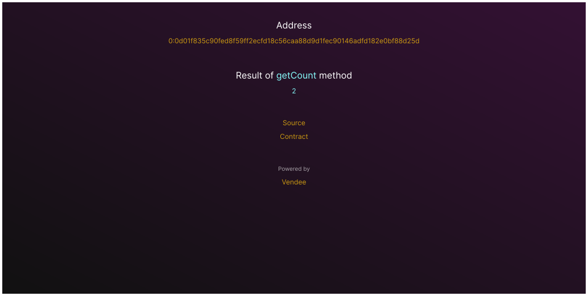
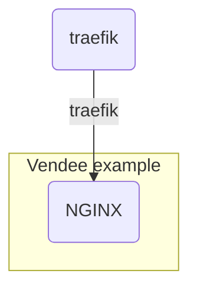

# Vendee example web




[example.vendee.top](https://example.vendee.top)

## Installation

```shell
yarn install && yarn env
```

## Start development

```shell
yarn start
```

## Build production and run on localhost

```shell
yarn prod
```

## Build production

```shell
yarn build
```

## Remove build

```shell
yarn rm
```

## Lint

```shell
yarn lint
```

```shell
yarn fix
```

## Up local

[Up infrastructure](https://github.com/kokkekpek/vendee-i12e#readme)

```shell
docker network create traefik
docker compose --env-file .env.local up
```

## Deploy on server

### Set secrets

* `SSH_DEPLOY_PRIVATE_KEY` - e.g. `AAAwEAA ...`

### Push code and check GitHub actions

[GitHub action]https://github.com/kokkekpek/vendee-example-web/actions/workflows/build-and-deploy.yaml)

## Docker network scheme


